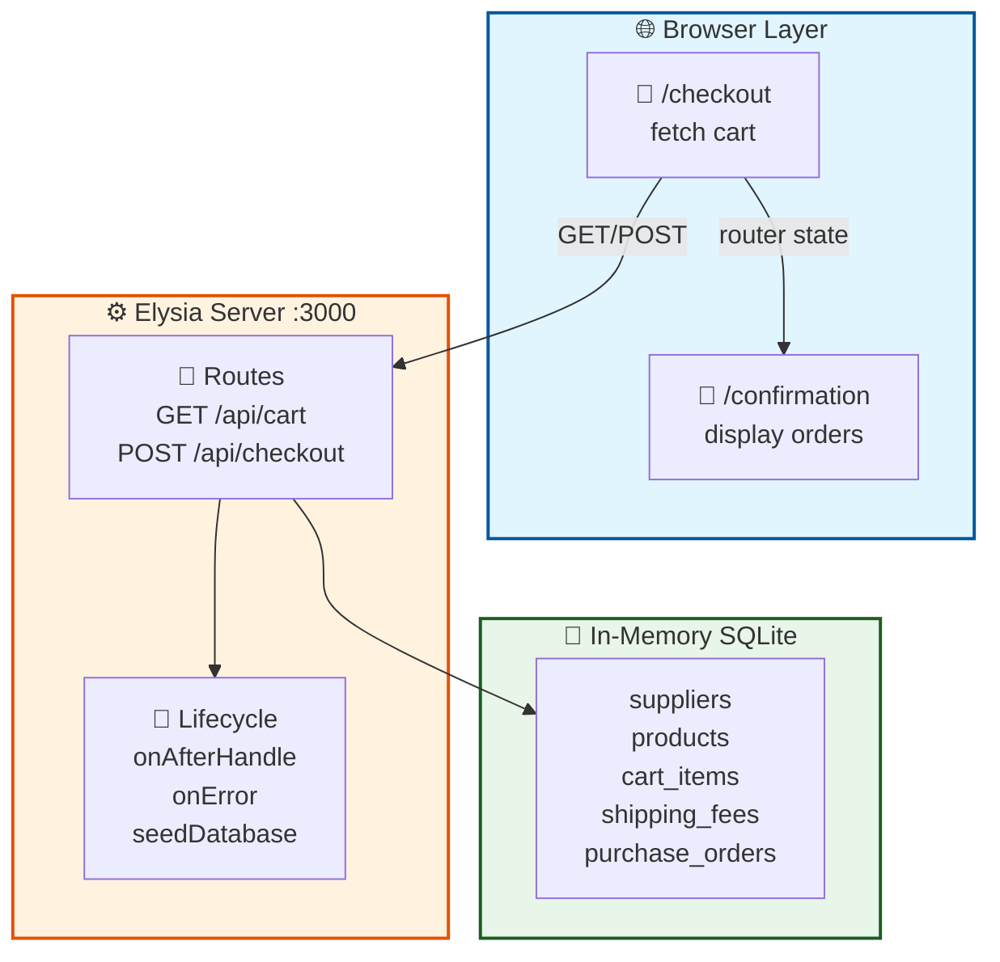
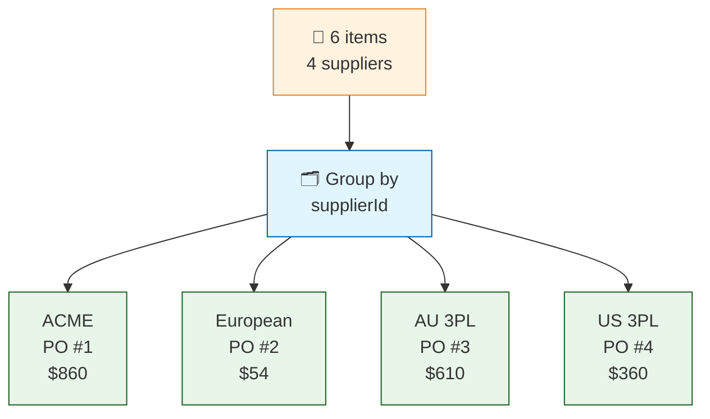
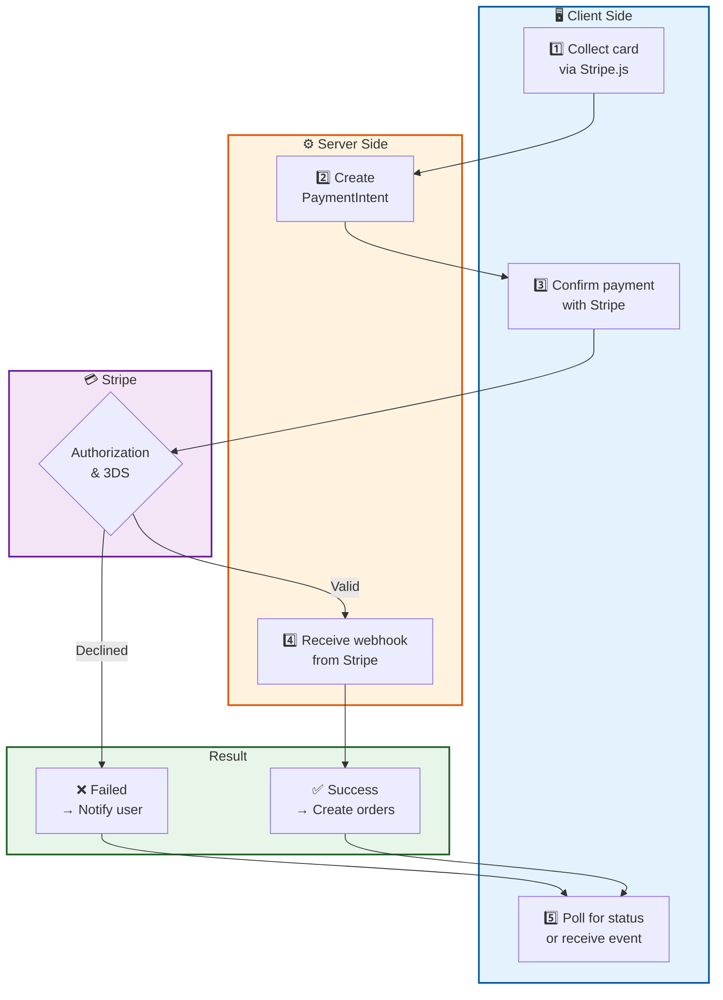

# System Design — noissue Checkout Exercise

## Overview

A full-stack ecommerce checkout flow that reads a static cart fixture, lets a user submit for checkout, and displays one purchase order per supplier on a confirmation page.

---

## Stack

| Layer | Technology |
|---|---|
| Runtime | Bun |
| Backend framework | Elysia (TypeScript) |
| ORM | Drizzle ORM |
| Database | SQLite (in-memory) |
| Frontend | React 19, React Router v7 |
| Styling | Tailwind CSS v4 |
| Testing | Bun test (unit/integration), Playwright (e2e) |
| Config | `PORT` env var (default `3000`) |

---

## Architecture



The server serves the compiled frontend bundle from `public/dist/` via `@elysiajs/static`. React Router handles client-side routing; unknown paths fall through to `index.html`.

---

## Data Model

### `suppliers`
| Column | Type | Notes |
|---|---|---|
| id | TEXT (PK) | Normalised from cart.json — leading zeros stripped |
| name | TEXT | e.g. "ACME Printing Co." |

### `products`
| Column | Type | Notes |
|---|---|---|
| sku | TEXT (PK) | e.g. "SKU001" |
| type | TEXT | "Custom" or "Stocked" |
| name | TEXT | |
| description | TEXT | Nullable |

### `cart_items`
| Column | Type | Notes |
|---|---|---|
| id | INTEGER (PK, auto) | |
| product_sku | TEXT (FK → products) | |
| supplier_id | TEXT (FK → suppliers) | |
| quantity | INTEGER | |
| currency | TEXT | "NZD" |
| symbol | TEXT | "$" |
| total | REAL | Line item price in NZD |

### `shipping_fees`
| Column | Type | Notes |
|---|---|---|
| id | INTEGER (PK, auto) | |
| supplier_id | TEXT (FK → suppliers) | One row per supplier |
| currency | TEXT | |
| symbol | TEXT | |
| total | REAL | Per-supplier shipping cost in NZD |

### `purchase_orders`
| Column | Type | Notes |
|---|---|---|
| id | INTEGER (PK, auto) | Used to generate the order reference shown to the user |
| supplier_id | TEXT (FK → suppliers) | One PO per supplier |
| item_total | REAL | Sum of all item totals for this supplier |
| shipping_fee | REAL | Supplier-specific shipping fee |
| order_total | REAL | item_total + shipping_fee |
| currency | TEXT | |
| symbol | TEXT | |

### `purchase_order_items`
| Column | Type | Notes |
|---|---|---|
| id | INTEGER (PK, auto) | |
| po_id | INTEGER (FK → purchase_orders) | |
| product_sku | TEXT | |
| quantity | INTEGER | |
| total | REAL | |

---

## API Endpoints

### `GET /api/cart`

Returns cart contents grouped by supplier, with product and supplier names joined in application code.

**Response**
```json
{
  "success": true,
  "data": {
    "suppliers": [
      {
        "supplierId": "1",
        "supplierName": "ACME Printing Co.",
        "products": [
          {
            "sku": "SKU001",
            "name": "Custom Tissue",
            "description": "1000 pieces, standard size...",
            "type": "Custom",
            "quantity": 1000,
            "currency": "NZD",
            "symbol": "$",
            "total": 300.00
          }
        ],
        "subtotal": 840.00,
        "currency": "NZD",
        "symbol": "$"
      }
    ],
    "grandTotal": 1834.00,
    "shippingTotal": 50.00,
    "currency": "NZD",
    "symbol": "$"
  }
}
```

---

### `POST /api/checkout`

Processes the checkout: groups cart items by supplier, creates one purchase order per supplier, and returns the generated orders. Takes no request body — the cart is the authoritative source of truth in the database.

**Response**
```json
{
  "success": true,
  "data": {
    "purchaseOrders": [
      {
        "poId": 1,
        "supplierId": "1",
        "supplierName": "ACME Printing Co.",
        "items": [
          {
            "poId": 1,
            "productSku": "SKU001",
            "quantity": 1000,
            "total": 300.00,
            "productName": "Custom Tissue",
            "productType": "Custom"
          }
        ],
        "itemTotal": 840.00,
        "shippingFee": 20.00,
        "orderTotal": 860.00,
        "currency": "NZD",
        "symbol": "$"
      }
    ]
  }
}
```

**Processing steps (in `processCheckout`)**

1. Load all cart items, shipping fees, products, and suppliers from SQLite
2. Build `Map<supplierId, cartItems[]>` by iterating cart items once
3. For each supplier group:
   - Sum item totals
   - Look up per-supplier shipping fee
   - Compute `orderTotal = itemTotal + shippingFee`
   - Insert row into `purchase_orders`, capture auto-incremented `poId`
   - Insert rows into `purchase_order_items`
4. Return enriched PO objects (with `supplierName`, `productName`, `productType` joined from lookup maps)

**Error responses**

409 — cart empty or already checked out:
```json
{ "success": false, "error": { "code": "CART_EMPTY_OR_CHECKED_OUT", "message": "Cart is empty or has already been checked out" } }
```

500 — unexpected server error (internal detail never exposed to client):
```json
{ "success": false, "error": { "code": "INTERNAL_ERROR", "message": "Internal server error" } }
```

All error responses follow the envelope `{ success: false, error: { code: string, message: string } }`. HTTP status codes are set explicitly: `409` for business-rule conflicts, `500` for unexpected failures.

On success, a structured log event is emitted:
```json
{ "event": "checkout.complete", "poCount": 4, "grandTotal": 1884, "supplierIds": ["1","2","3","4"] }
```

---

## Frontend Architecture

The checkout page is decomposed into focused modules under `public/pages/checkout/`:

| File | Responsibility |
|---|---|
| `Checkout.tsx` | Layout shell — composes form + summary, derives display values |
| `CheckoutForm.tsx` | Left column — Contact, Delivery, Shipping, Payment sections |
| `OrderSummary.tsx` | Right column — product list, discount input, totals |
| `useCart.ts` | Fetches `GET /api/cart`, returns typed `CartState` union |
| `useCheckoutForm.ts` | Form state, validation (Luhn, expiry), all handlers, submit logic |

`public/pages/Checkout.tsx` is a one-line re-export shim so `public/index.tsx` imports are unchanged.

---

## Frontend Data Flow

```
Checkout page mounts
  → useCart hook: GET /api/cart
  → renders 6 real products across 4 suppliers in Order Archive sidebar
  → shows "Your cart is empty." when suppliers array is empty
  → shows NZD subtotal only (shipping hidden until user selects method)

Step 1 — Contact: user enters email (required, validated on blur)

Step 2 — Delivery: user fills address fields
  → required: Address Line 1, City, Postcode, Country (default: New Zealand)
  → optional: First Name, Last Name, Apartment/suite, State/Region (free text)
  → once all 4 required fields are non-empty → Shipping method section reveals

Step 3 — Shipping: user selects "Standard Shipping – NZD $50.00"
  → shipping line item appears in order summary
  → total updates: grandTotal + $50

Step 4 — Payment: user fills credit card fields
  → card number auto-formats to groups of 4 (XXXX XXXX XXXX XXXX)
  → expiry auto-formats to MM/YY
  → Luhn algorithm validates card number on blur
  → Pay now button enables only when all validation passes:
     email valid + address complete + shipping selected + card valid

User clicks "Pay now"
  → POST /api/checkout (no body — cart is read from DB server-side)
  → on success: navigate('/confirmation', { state: { purchaseOrders, shippingAddress } })

Confirmation page reads location.state
  → renders purchase orders grouped by supplier with real totals
  → renders shipping address entered in the form
  → displays order reference derived from first PO id: e.g. #NI-0001-ECO
  → if location.state is absent (direct navigation or page refresh) → redirect to /
```

Form data (name, address) is captured as controlled React state and passed to the confirmation page via React Router's `location.state`. Card details are validated client-side only and never sent to the backend.

---

## Key Architectural Decisions

### In-memory SQLite, seeded on startup
The database initialises fresh from `cart.json` on every server start. This eliminates migration complexity for the exercise scope while still using a proper relational schema through Drizzle ORM. The trade-off is that no data is persisted across restarts.

### Supplier ID normalisation
`cart.json` has a format inconsistency: product `supplierId` values use zero-padded 5-digit strings (`"00001"`) while `shippingFees.supplierShippingFees` uses 4-digit strings (`"0001"`). Both are normalised to bare integer strings (`"1"`) by stripping leading zeros at seed time, so joins work uniformly throughout the system.

### One purchase order per supplier
Cart items are grouped by `supplierId` into a `Map` before any database writes. Each supplier group produces exactly one `purchase_orders` row and N `purchase_order_items` rows. The shipping fee is applied at the supplier level, not globally.

### No request body on `POST /api/checkout`
The checkout endpoint reads the cart entirely from the database rather than accepting item lists in the request body. This prevents client-side cart manipulation and keeps the backend as the single authoritative source of what is being purchased.

### Router state for confirmation data
Purchase orders and the shipping address are passed to the confirmation page via React Router's `navigate(path, { state })`. This avoids a second API call and the need to persist order data server-side between requests. The trade-off is that refreshing `/confirmation` loses the state — the page handles this gracefully by redirecting to `/`.

### Application-level joins
Both `GET /api/cart` and `processCheckout` join tables in application code using `Map` lookups rather than SQL `JOIN` clauses. Given the dataset is small and fully in-memory, this performs equivalently to SQL joins and is simpler to read. A persistent database with large datasets would warrant SQL joins instead.

---

## Cart Data Summary

| Supplier | Products | Items Total | Shipping | Order Total |
|---|---|---|---|---|
| ACME Printing Co. | Custom Tissue ×2 | $840 | $20 | $860 |
| European Printing Co. | Custom Stamp Creator ×1 | $44 | $10 | $54 |
| AU 3PL Co. | Recycled Mailer, Compostable Mailer | $600 | $10 | $610 |
| US 3PL Co. | Compostable Shipping Labels | $350 | $10 | $360 |
| **Total** | **6 products** | **$1,834** | **$50** | **$1,884 NZD** |

---

## Form Validation

Client-side only. Validation runs on blur per field and on submit attempt.

| Field | Rule |
|---|---|
| Email | Required; must match `user@domain.tld` pattern |
| Address Line 1 | Required (non-empty after trim) |
| City | Required (non-empty after trim) |
| Postcode | Required (non-empty after trim) |
| Shipping method | Must be selected (unlocks after address is complete) |
| Card number | Required; 16 digits after stripping spaces; Luhn algorithm |
| Cardholder name | Required (non-empty after trim) |
| Expiry | Required; `MM/YY` format; month 01–12; not in the past |
| CVV | Required; 3–4 digits |

The Pay Now button only becomes active when all of the above pass simultaneously. On submit with invalid state, all fields are marked touched and errors are shown inline with `role="alert"` for screen reader support.

---

## Test Coverage

| Layer | Runner | Count | What is tested |
|---|---|---|---|
| Service | Bun test | 7 | `processCheckout` logic, `seedRandomCart` |
| Route | Bun test | 8 | HTTP status codes, response shapes, 409 on empty/duplicate cart |
| Cart route | Bun test | 7 | `GET /api/cart` grouping, `POST /api/cart/random` |
| E2E | Playwright | 5 | Happy path, empty cart state, form validation errors, 409 duplicate submission, mobile 375 px no-overflow |

---

## Known Limitations (exercise scope)

- **Partial idempotency on checkout** — `processCheckout` deletes cart items after a successful run, so a duplicate submission while the cart is empty returns `409 CART_EMPTY_OR_CHECKED_OUT`. However, if the cart is repopulated (e.g. via `POST /api/cart/random`) before a second submission, new purchase orders are created. A production system would use an explicit idempotency key.
- **State lost on refresh** — the confirmation page redirects to `/` if `location.state` is absent. A production implementation would persist orders by ID and expose `GET /api/orders/:id`.
- **Single global cart** — there is no user session concept; the cart is fixed at server startup.
- **Mock payment only** — credit card fields are validated client-side (Luhn, expiry, CVV format) but no payment gateway integration exists. Card data is never transmitted to the backend.

---

## Production Considerations

This section describes how the exercise's design maps to production requirements and what would change in a real system.

---

### Authentication

**Current system:** There is no authentication. The server is a single-user demo with no concept of identity. Any browser that reaches the server can read the cart and submit checkout.

**Production approach:** Issue a session token (JWT or opaque session ID in an `HttpOnly` cookie) at login or on cart creation. Every API request carries this token; the server validates it before accessing cart or order data.

Key decisions:
- **Token issuance** — login endpoint or OAuth callback returns a short-lived access token (e.g. 15 min) + a long-lived refresh token stored server-side and rotated on use.
- **Middleware** — an Elysia `derive` guard extracts and verifies the token before route handlers run; unauthenticated requests return `401`.
- **CSRF** — because the frontend is a same-origin SPA, `SameSite=Strict` on the session cookie is sufficient. Cross-origin calls would additionally require a CSRF double-submit cookie.
- **Guest checkout** — create an anonymous session ID on first cart interaction; upgrade it to a fully-authenticated record after the buyer provides an email.

```
POST /api/auth/login      → issues session cookie
POST /api/auth/refresh    → rotates token pair
DELETE /api/auth/logout   → revokes refresh token server-side
GET  /api/orders          → requires valid session, scoped to that user
```

---

### Multi-supplier orders

**Current system:** Fully implemented. `processCheckout` groups cart items by `supplierId` into a `Map`, then creates exactly one `purchase_orders` row and N `purchase_order_items` rows per supplier in a single pass. Shipping is applied at the supplier level. The buyer sees one order reference (e.g. `#NI-0001-ECO`) while the database holds a discrete PO per supplier.

**How the split works:**



**Production additions:**
- Wrap all `INSERT` statements in a single database transaction so a failure mid-way leaves no partial orders.
- Add an idempotency key (e.g. a client-generated `checkoutToken`) stored alongside the order; duplicate submissions within a window return the existing result rather than inserting new rows.
- Emit a `checkout.completed` domain event per PO so downstream services (fulfilment, supplier notification) can subscribe without coupling to the checkout service.

---

### Payment failures

**Current system:** Payment is entirely mocked. The frontend validates card fields using Luhn, format checks, and expiry validation, but no data is transmitted to any payment gateway. `POST /api/checkout` succeeds unconditionally if the server is reachable.

**Production approach:** Integrate a payment provider (e.g. Stripe) and handle failures at each stage:



Failure handling by stage:

| Stage | Failure | Handling |
|---|---|---|
| Card authorisation | Card declined | Stripe returns decline code; surface user-friendly message; no order created |
| Network to Stripe | Timeout / 5xx | Retry with exponential backoff (max 3 attempts); preserve cart on exhaustion |
| Webhook delivery | Our server down | Stripe retries webhooks for 72 h; idempotency key prevents double-processing on replay |
| Order creation after capture | DB error | Log the PaymentIntent ID; reconciliation job detects captured-but-unconfirmed intents and creates the order retroactively |
| Partial fulfilment | One supplier unavailable | Full charge is taken; fulfilment system issues a per-supplier refund for unavailable items |

The key invariant: **money only moves after the webhook confirms capture**. The `purchase_orders` row is only written inside the webhook handler, never inside the client-initiated checkout call.

---

### Database scaling — multiple users and multiple carts

**Current system:** A single in-memory SQLite instance is created at process startup and seeded from `cart.json`. It is global and ephemeral. All visitors share the same cart; there is no user isolation and no data survives a restart.

**Production approach:**

**1. Schema additions**

Add `users` and `carts` tables so each cart belongs to a user:

```sql
users(id, email, created_at)
carts(id, user_id FK, status, created_at)   -- status: open | processing | checked_out | abandoned
cart_items(id, cart_id FK, ...)             -- replaces global cart_items
```

`purchase_orders` gains a `cart_id` foreign key so orders are traceable to the cart that produced them.

**2. Persistent database**

Replace in-memory SQLite with PostgreSQL. Drizzle ORM supports PostgreSQL with near-identical schema syntax — the migration is primarily a driver swap (`bun:sqlite` → `drizzle-orm/node-postgres`). Add a connection pool (e.g. PgBouncer) to prevent connection exhaustion under concurrent load.

**3. Checkout concurrency**

Checkout reads and writes must be serialisable to prevent two concurrent requests from double-processing the same cart:

```sql
-- Optimistic lock: only one request transitions open → processing
UPDATE carts SET status = 'processing'
WHERE id = $cartId AND status = 'open'
RETURNING id;
-- 0 rows affected → cart already in flight → return 409 Conflict
```

Wrap the full checkout operation (status update → PO inserts → status → `checked_out`) in a single database transaction so partial writes are impossible.

**4. Horizontal scaling**

| Concern | Approach |
|---|---|
| Multiple server instances | Stateless handlers — session lives in DB + cookie, not process memory |
| Read-heavy cart pages | Read replicas for `GET /api/cart`; writes go to primary |
| Schema changes | Run Drizzle migrations before deploying new code; use backward-compatible column additions |

**5. Data lifecycle**

- **Abandoned carts** — a background job marks carts `abandoned` after N days of inactivity.
- **Order history** — `GET /api/orders` returns all `purchase_orders` for the authenticated user, paginated.
- **Audit trail** — an append-only `order_events` table records every state transition (created → processing → fulfilled → refunded) for support and compliance.
